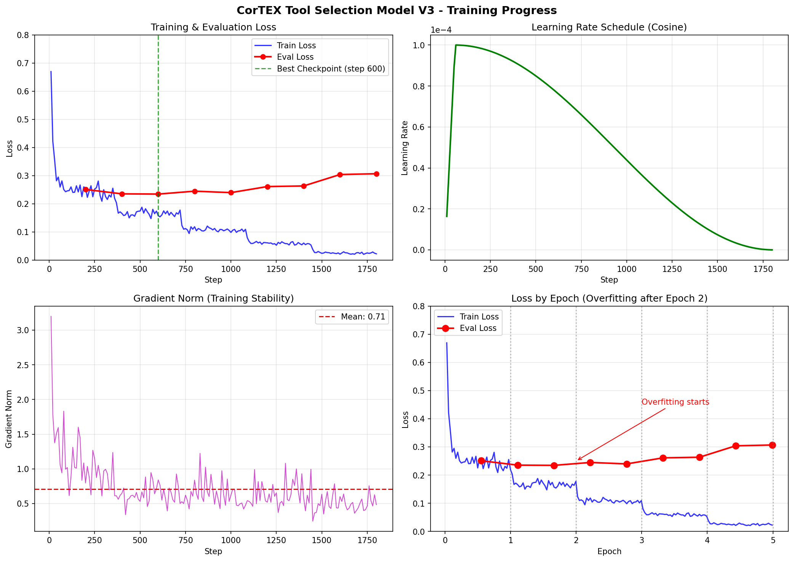
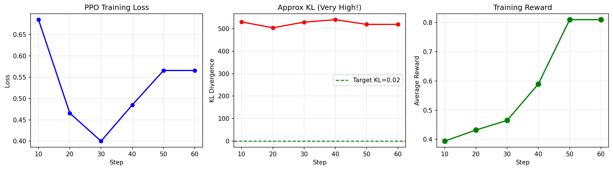
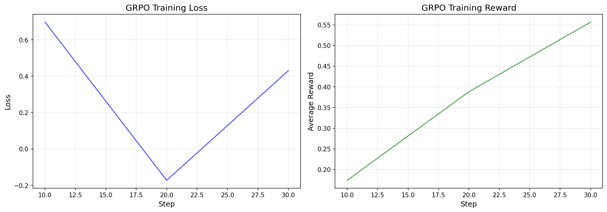

# CorTEX
 CORTEX (COntrolled Reasoning Tool EXpert), a multimodal reasoning agent that combines visual understanding with deterministic function calling for explainable medical decision-making. Inspired by TxAgent's structured tool reasoning and MMedAgent's multimodal capabilities, CORTEX unifies textual and visual tool-based reasoning by fine-tuning a Vision-Instruct model through supervised and reinforcement learning on biomedical instruction datasets.

## Code Files
### Model Download File
[llava-med-basic-test.ipynb](./llava-med-basic-test.ipynb)

### Dataset Generation, Cleaning and Exploring files
- [Download MedS-Ins Dataset](./dataset_generation_files/download_meds_ins.py)
- [Download PMC articles VisualQA](./dataset_generation_files/download_images.py)
- [Generate Tool Selection Dataset with TxAgent ToolRAG model](./dataset_generation_files/generate_toolcalling_data.py)
- [Clean Tool Selection Dataset from TxAgent](./dataset_generation_files/clean_dataset.py)
- [Analyzing Tool Selection Dataset](./dataset_generation_files/analysis_tool_selection_data.ipynb)

- [Exploring TxAgent](./)

### M1 Tool Selection Training
- [M1 Tool selection training](./M1tool-selection-training/train_tool_selection_v3.py)

### M2 Readoning Training
- [SFT Vision & Text Scripts](./finetune-llavamed/M2-SFT-TextVision/)
- [GRPO Training Scripts](./GRPO/)
- [PPO Training Scripts](./PPO/)

### Evaluation Scripts
- [Evaluate Tool Calling](./evaluation_scripts/evaluate_tool_calling.py)
- [Evaluate End2End](./evaluation_results/evaluatee2e.py)

### Prediction & Inferencing Scripts
- [Generating predictions for Visual Question Answering](./prediction_scripts/generate_predictions_vqa.py)
- [Inference Tool Selection](./prediction_scripts/inference_tool_selection.py)
- [Inference MedInst](./prediction_scripts/predict_medinst.py)
- [Inference Finetine](./prediction_scripts/predict_medinst_finetuned.py)


<hr>

# Steps:

## 1. Benchmarking LLava-Med Model

### Basic LLava-Med Testing

1. Run the [llava-med-basic-test.ipynb](./llava-med-basic-test.ipynb) to download the model weights.

### VQA Dataset (PMC article 60K-IM)
1. Run the [download_images.py](./dataset_generation_files/download_images.py) to download (PMC-15M dataset). Pass the urls to get the images.
2. Datasetfor visual QA added in [VisualQA-Dataset](.datasets/VisualQA-Dataset/)
3. Generate predictions using this script:
    1. [predictions](./llava_med_vqa_predictions.jsonl) for the VQAdataset.
        Generated predictions: [custom_prediction_generation](./llava_med_vqa_predictions.jsonl)
    2. OR Using the LLava-Med prediction script
        Generated predictions: [predictions_using_llava_script](./llava_med_answers.jsonl)
    ```
    python llava/eval/model_vqa.py     --conv-mode mistral_instruct     --model-path /home/azureuser/.cache/huggingface/hub/models--microsoft--llava-med-v1.5-mistral-7b/snapshots/91bb16c122001ddc9cf1fd36ce1dae09448943a2     --question-file data/eval/llava_med_eval_qa50_qa.jsonl     --image-folder data/data/images     --answers-file ../llava_med_answers.jsonl     --temperature 0.0
    ```
4. Evaluations:
Use the llava-med Chat GPT Scaring Eval script
```
python llava/eval/eval_multimodal_chat_gpt_score.py \
    --answers-file ../llava_med_vqa_predictions.jsonl \
    --question-file ../datasets/VisualQA-Dataset/llava_med_eval_qa50_qa.jsonl \
    --scores-file ../llava_med_vqapred_scores.jsonl
```
To summarize the scores:
```
python llava/eval/summarize_gpt_review.py \
    --scores-file ../llava_med_vqa_scores.jsonl
```
|   |   |   |   |   |   |   |   |   |
|---|---|---|---|---|---|---|---|---|
|   |conversation|  detailed_description|  chest_xray|        mri|  histology|      gross|    ct_scan|     overall|
|gpt4_score |              9.132867|              8.500000|    8.783784|   9.131579|   8.931818|   8.852941|   9.125000|    8.968912|
|pred_score             |  5.132867             |3.140000|    4.945946 |  3.789474 |  4.954545 |  4.764706 |  4.600000|    4.616580|
|pred_relative_score    | 59.254079             |37.325397|   56.790004|  42.544904|  56.401515|  61.715686|  51.041667|   53.573073|
|data_size              |143.000000             |50.000000|   37.000000|  38.000000|  44.000000|  34.000000|  40.000000|  193.000000|

### MedINST Dataset (Multiple Choice Question Answering)
(“Meta Dataset of Biomedical Instructions”) — A large-scale multi-domain/multi-task instruction dataset spanning ~7 million instruction-samples across 133 biomedical NLP task
1. Dataset used [](./datasets/MedInst/MedQa_test.json)
2. Run [predict_medinst](./predict_medinst.py) to generate predictions
```
python predict_medinst.py \
    --model-path /home/azureuser/.cache/huggingface/hub/models--microsoft--llava-med-v1.5-mistral-7b/snapshots/91bb16c122001ddc9cf1fd36ce1dae09448943a2 \
    --input-file datasets/MedInst32/MedQa_test.json \
    --output-file llava_med_medinst_predictions.jsonl
```
Total samples: 1273
Correct: 418
Accuracy: 32.84%

### MedS-Ins Dataset
Dataset link - https://huggingface.co/datasets/Henrychur/MedS-Ins
1. Download dataset using [MedS-Ins data download](./dataset_generation_files/download_meds_ins.py). 136 tasks (4k examples each)

## 2. Finetuning the LLava-Med Model on MedINST dataset
We use SFT using LoRA-PEFT

1. Use [finetune-script for medinst](./finetune_llava_med.py)
For testing on a small batch
```
CUDA_VISIBLE_DEVICES=0 python finetune_llava_med.py \
    --data_path datasets/MedInstQA/MedQa_train.json \
    --max_samples 100 \
    --output_dir ./llava-med-finetuned \
    --num_train_epochs 3 \
    --per_device_train_batch_size 2 \
    --logging_steps 50 \
    --save_strategy "epoch" \
    --use_lora True
```

Using DeepSeed - Faster training
```
./train_multigpu.sh 4 datasets/MedInstQA/MedQa_train.json ./llava-med-finetuned 3 2 4
```

2. Generate predictions and evaluate the finetuned model [evaluation script](./predict_medinst_finetuned.py)
```
python predict_medinst_finetuned.py \
    --lora-adapter-path llava-med-finetuned \
    --input-file datasets/MedInstQA/MedQa_test.json \
    --output-file llava_med_finetuned_predictions.jsonl \
    --max-samples 20 \
```
Summary - 
  "total_samples": 1273,
  "correct": 661,
  "accuracy": 51.92,


## 3. Tool RAG
Selects suitable candidate from Tool Universe based on description
https://huggingface.co/mims-harvard/ToolRAG-T1-GTE-Qwen2-1.5B

- Discovering - add suitable tools for the MedInst Dataset [tool_rag model](./tool_rag.ipynb)
- Script to run inference on MedInstdataset [run_txagent_inference](./dataset_generation_files/generate_toolcalling_data.py)
- Run to run all the generation script on all GPUS, with different data portions - [launch-gpu](./launch_all_gpus.sh)

- Analyzing Tool Selection Data [tool selection analysis](./dataset_generation_files/analysis_tool_selection_data.ipynb)

## 4. Training Tool Selection (M1 model)
- [Training model for tool selection](./train_tool_selection.py)
- [Run Training script](./run_tool_selection_training.sh)
- [Evaluation trained model](./evaluate_tool_selection.py)
- [Inference on trained model](./inference_tool_selection.py)



### 4.1 Evaluating the ToolRAG
Created the whole Prompt

Base Model Eval
```
PROTOCOL_BUFFERS_PYTHON_IMPLEMENTATION=python CUDA_VISIBLE_DEVICES=3 python evaluate_tool_selection.py --output-file evaluation_results/tool_selection_v3_prompt_eval.json --gpu 3 --adapter-path none 2>&1 | tee evaluation_results/eval_v3_base_log_prompt.txt
```

Finetuned Model Eval
```
PROTOCOL_BUFFERS_PYTHON_IMPLEMENTATION=python CUDA_VISIBLE_DEVICES=4 python evaluate_tool_selection.py --output-file evaluation_results/tool_selection_v3_600chkptk_prompt_eval.json --gpu 4 --adapter-path checkpoints/llava-med-tool-selection-v3/checkpoint-600 2>&1 | tee evaluation_results/eval_v3_600chkpt_log_prompt.txt
```
Results and Logs stored in [evaluation-results](./evaluation_results/M1-toolselection/)

## 5. Training Reasoning (M2 Model)

### 5.1 ST only
Alignment ataset present in [Vision Data](./datasets/VisualQA-PMCArticle-Dataset/)
Training using [Finetune vision model](./Finetune_Llama3_2_(11B)_Vision.ipynb)

Train on text data
```
CUDA_VISIBLE_DEVICES=2 python finetune_llava_med_v2.py     --data_path datasets/M2training/text_data.jsonl       --output_dir ./checkpoints/M2LlavaMed-finetuned-text     --num_train_epochs 3     --per_device_train_batch_size 1     --logging_steps 50     --save_strategy "epoch"     --use_lora True   --gradient_accumulation_steps 8   --gradient_checkpointing True
```
```
CUDA_VISIBLE_DEVICES=2 python finetune_llava_med_v2.py     --data_path datasets/M2training/vision_data.jsonl      --lora_checkpoint checkpoints/M2LlavaMed-finetuned-text/checkpoint-642   --output_dir ./checkpoints/M2LlavaMed-finetuned-vision     --num_train_epochs 3     --per_device_train_batch_size 1     --logging_steps 50     --save_strategy "epoch"     --use_lora True   --gradient_accumulation_steps 8   --gradient_checkpointing True
```


### 5.2 PPO only
```
CUDA_VISIBLE_DEVICES=1,3,5,7,2,4,6 torchrun --nproc_per_node=7 ppo_trainer.py
```


### 5.3 GRPO only
```
bash launch_grpo_training.sh
```



